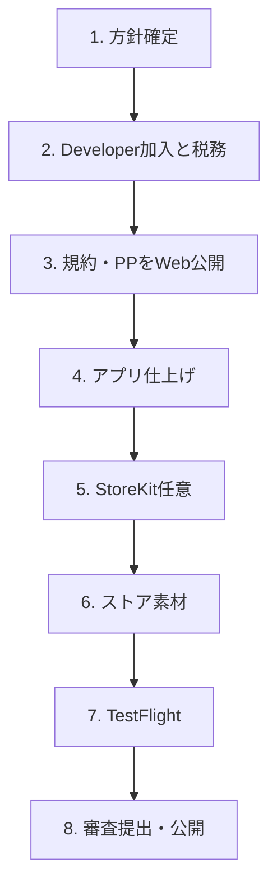

# App Store 掲載準備ガイド

レトロサウンド（GameSoundCreator）を App Store に公開するまでの進め方です。  
製品仕様は [SPEC.md](SPEC.md)、全体計画は [ROADMAP.md](ROADMAP.md)（Phase 5）を正とします。

| 項目 | 内容 |
|------|------|
| 文書バージョン | 0.2 |
| 最終更新 | 2026-08-10 |
| 対象 | 一人開発・iOS 初回公開 |

---

## 1. いまの前提

| 項目 | 現状（2026-08-10） |
|------|---------------------|
| 表示名 | レトロサウンド |
| Bundle ID | `com.trueocean.GameSoundCreator` |
| Marketing Version | `0.1.0`（ビルド `1`） |
| 対象 | iPhone / iOS 17+ / 縦向きのみ |
| アプリアイコン | 投入済み |
| 課金・広告 | 未実装 |
| 利用規約・プライバシーポリシー | 未作成 |
| Privacy Manifest（`PrivacyInfo.xcprivacy`） | 未作成（`@AppStorage` による UserDefaults 利用あり） |
| App Privacy（App Store Connect） | 未申告。端末外へのデータ送信と第三者SDKの有無を提出直前に再監査する |
| 端末内データ | テーマ設定（UserDefaults）、ライブラリ（Documents 内 `library.json`）、書き出しWAV（Documents） |
| ファイル共有 | 有効。Documents 内のファイルはFilesアプリ／Finderから扱える |
| 設定画面 | 開発用「旧スタジオ」がReleaseにも表示中。規約・プライバシーポリシーへのリンクは未実装 |
| バージョン表記 | ビルド設定は `0.1.0 (1)`、設定画面の固定表示は `0.3.4 (UI磨き)` で不一致 |
| 方針 | 完全ローカル・手続き生成・オフライン・クラウドAI不使用 |
| ブランド | 起動画面に ChatNoir Studio |

コア機能の品質は概ね満足できる段階です。ただし、上記のプライバシー対応、開発用UI、バージョン表記の不一致は提出前に解消する必要があります。

---

## 2. 推奨する進め方（全体順序）

| 順 | テーマ | 目安 |
|----|--------|------|
| 1 | 収益モデル・公開範囲の確定 | 半日 |
| 2 | Apple Developer Program＋税務・銀行 | 数日〜審査待ち |
| 3 | プライバシーポリシー／サポートURL／利用規約 | 数日 |
| 4 | Privacy Manifest・1.0.0・開発用UI整理・実機確認 | 数日 |
| 5 | （推奨）StoreKit 2 買い切り Pro | 1〜2 週 |
| 6 | スクリーンショット・説明文・Connect登録 | 数日 |
| 7 | TestFlight（内部→少人数外部） | 1 週前後 |
| 8 | App Review 提出・指摘対応・公開 | 審査待ち＋バッファ |

ROADMAP 上の目安: Phase 5 は **3〜6 週**、公開は品質・法務バッファ込みでその前後。

---

## 3. Step 1 — 製品方針の確定

実装・メタデータの前提になるため、最初に決める。

### 3.1 収益モデル（推奨）

SPEC §10 / ROADMAP Phase 5 の推奨順:

1. まず **無料（TestFlight）** で品質を固める  
2. 公開時は **無料＋書き出し制限＋買い切り Pro**  
3. 広告は後回し（ATT・プライバシー申告が複雑になる）

| 機能 | Free（案） | Pro（買い切り） |
|------|------------|-----------------|
| 試聴・別パターン | ○ | ○ |
| 書き出し | 1日 N 回など制限 | 無制限 |
| 基本カタログ | ○ | ○ |
| 追加機能（将来） | × | ○ |
| 広告 | なし（当面） | — |

**課金ゲートは App 層のみ。** Intent Mapper / AudioGenCore は課金を知らないこと。

### 3.2 その他の決定事項

- [ ] 無料枠の具体値（例: 書き出し 1日 3 回）
- [ ] Pro の価格帯
- [ ] 初回公開バージョン（推奨: `1.0.0`。現行 `0.1.0` は開発用）
- [ ] ストア上のアプリ名最終表記（端末表示「レトロサウンド」との関係）
- [ ] ChatNoir Studio の著作権・開発者名の表記統一
- [ ] iPad 対応の有無（現状は iPhone のみで可）
- [ ] メタデータ言語（日本語のみか、英語も用意するか）
- [ ] **最小公開**（課金なし・無料のみ）で先に出すか、**Pro込み**で出すか

---

## 4. Step 2 — アカウント・費用

- [ ] [Apple Developer Program](https://developer.apple.com/programs/) に加入（年額・公開と本格 TestFlight に必須）
- [ ] Xcode → Signing & Capabilities で Team を有料アカウントに切替
- [ ] [App Store Connect](https://appstoreconnect.apple.com/) で **Agreements, Tax, and Banking** を完了  
  - 有料配信・IAP をする場合は必須。未完了だと課金が通らない
- [ ] サポート用の公開窓口（メール、または簡易 Web）を決める

無料 Apple ID ではシミュレータ／自分端末の制限付き実行まで。**Store 公開と広い TestFlight は有料プログラムが必要**（詳細は [ENVIRONMENT.md](ENVIRONMENT.md)）。

---

## 5. Step 3 — 法務・公開 URL

提出時に実在する公開URLを登録する。Privacy Policy URL は全アプリで必須であり、アプリ内からも容易に開けるようにする。Support URL はApp Store Connectの必須項目であり、実際に連絡できる窓口を示す。HTTPS を使用し、プレースホルダーや空ページを置かない。

| 種別 | 必須？ | 内容 |
|------|--------|------|
| **Privacy Policy URL** | 必須 | 収集の有無、端末内保存、第三者送信、保持・削除方針、連絡先。オフライン方針を明記 |
| **Support URL** | 必須 | 問い合わせ方法。実際に使えるメールアドレス等を掲載 |
| 利用規約 | 強く推奨 | 生成物の権利・責任・禁止事項 |
| マーケティング URL | 任意 | LP など |
| EULA | 任意 | Apple 標準でも可。生成物の権利を強く言うならカスタム検討 |

### プライバシーポリシーに必ず実態どおり記す事項

- 端末外へ個人データを送信しないこと（将来、解析・広告・クラウド機能を追加するなら方針とApp Privacy申告を更新する）
- 保存するデータ: テーマ設定、ライブラリ情報、書き出したWAV
- 保存場所と削除方法: アプリ内のライブラリ削除、Filesアプリ／FinderでのDocuments内ファイルの削除
- 共有シートでは、ユーザーが選んだ共有先にWAVを渡すこと
- 問い合わせ先

端末内に留まり、開発者または第三者がアクセスできる形で端末外へ送信されないデータは、通常、App Privacyにおける「収集」には当たらない。ただし、提出時点のコードと組み込みSDKを再監査してApp Store Connectで最終回答する。

### 生成物の権利（推奨方針）

SPEC §10.3 より:

- **ユーザーが生成した音はユーザーが利用可**（商用ゲームへの組み込み含む想定）
- アプリ自体の再配布・リバース等は不可
- 同梱音源・フォントを足す場合はライセンスを `NOTICE` 等で管理（現状は合成のみ）

### 表記上の注意

- 「AI」と誤認されないこと（**手続き生成 / シンセサイザーベース / オフライン**）
- プライバシーポリシー・App Privacy 申告・実アプリの挙動を一致させる

ホスティング例: GitHub Pages、Notion 公開、自前ドメインの静的ページ。

---

## 6. Step 4 — アプリ側の技術仕上げ

### 6.1 必須に近いもの

- [ ] 設定などから **利用規約・プライバシーポリシー**を開ける（現状は未実装）
- [ ] 生成音の権利・手続き生成である旨をアプリ内でも確認できる
- [ ] **`PrivacyInfo.xcprivacy`** を追加  
  - `@AppStorage` による `UserDefaults` は Required Reason API として、実際に該当する承認済み理由を宣言
  - これはApp Privacy申告とは別。追跡ドメイン（該当する場合）や利用するRequired Reason APIを実態どおり記載する
- [ ] App Store Connect の **App Privacy** を提出時のコード・SDK監査結果で回答
  - 現状の完全ローカル方針を維持できていれば「データを収集しない」が候補。共有シート、ファイル保存、UserDefaultsだけでは通常、端末外への収集にはならない
- [ ] App Store Connect の **暗号化（輸出コンプライアンス）** 質問に実装・配布地域に基づき回答
  - 免除を前提にせず、提出時の質問とAppleの案内を確認する
- [ ] **開発用 UI**（設定→開発用・旧スタジオ）を審査ビルドで隠すか削除（現状は表示中）
- [ ] 実機で一連操作確認（BGM／SE／保存／書き出し／共有／バックグラウンド）
- [ ] **Release Archive** で動作確認（Debug 専用コードがないこと）
- [ ] Marketing Version と設定画面の表示を `1.0.0` 等へ統一する
- [ ] 新しいバイナリをアップロードするたびに **Build番号をインクリメント**する。アップロード処理自体が失敗した場合は、同じBuild番号を再利用できることがある

### 6.2 収益化するとき

- [ ] StoreKit 2（非消耗型・買い切り）
- [ ] 購入のリストア
- [ ] Free 制限の実装（書き出し回数など）
- [ ] App Store Connect で IAP 商品作成
- [ ] Sandbox アカウントで実機購入テスト

### 6.3 後回しでよいもの

- AdMob 等の広告（入れるなら ATT・トラッキング方針が追加で必要）
- アカウントログイン（無ければアカウント削除要件なし）
- Phase 4（カードバトル投入）は販売の必須条件ではない（デモには有効）

---

## 7. Step 5 — App Store Connect 登録

- [ ] 新規アプリ作成（Bundle ID `com.trueocean.GameSoundCreator` を紐付け）
- [ ] 価格と配信地域
- [ ] 年齢レーティングアンケート
- [ ] **App Privacy（栄養成分表示）**  
  - 現状のコードと依存関係を提出直前に監査する。完全ローカル方針を維持できていれば「データを収集しない」が候補
  - 広告・解析・クラウド機能・外部SDKを入れたら、プライバシーポリシーと申告を更新する
- [ ] カテゴリ選定（Music / Utilities / Entertainment など）
- [ ] 著作権表示（例: © ChatNoir Studio）
- [ ] コンテンツ権利・輸出コンプライアンスの回答
- [ ] （IAP ありなら）課金商品をバージョンに紐付け

---

## 8. Step 6 — 掲載用アセット・文言

### 8.1 ビジュアル

| 素材 | 状態・要件 |
|------|------------|
| App Icon 1024×1024 | 済み（透過なし・角丸なし） |
| iPhone スクリーンショット | 未着手。App Store Connectで受け付ける **6.9インチ系**のいずれかのサイズ（例: 1320×2868）を使用。実UIを写し、透過なしPNG/JPEGにする |
| 枚数 | 1〜10枚。ホーム／BGM／SE／ライブラリなど3枚以上を推奨 |
| プレビュー動画 | 任意（最大約 30 秒） |

### 8.2 テキスト

| 項目 | 制限の目安 | メモ |
|------|------------|------|
| アプリ名 | 30 文字 | 「レトロサウンド」±差別化 |
| サブタイトル | 30 文字 | オフラインで BGM・SE 生成 など |
| プロモーションテキスト | 170 文字 | 審査なしで後から変えやすい |
| 説明文 | 4000 文字 | 下記ポイントを含める |
| キーワード | 100 文字 | カンマ区切り |
| 新機能 | — | 初回は「初回リリース」程度で可 |

説明で押さえるポイント:

- 用途・シーンを選ぶだけで作れる
- **完全ローカル・オフライン**
- **クラウド AI ではない**手続き生成
- ゲーム向け BGM／効果音、ファイル書き出し・共有

---

## 9. Step 7 — TestFlight

1. Xcode で **Product → Archive → Distribute App → App Store Connect**
2. **内部テスト**で自分確認
3. **外部テスト**（少人数でよい。ベータ審査あり）
4. フィードバック反映後、本番バージョンを審査提出

### 審査メモ（Review Notes）に書くとよいこと

- オフライン動作であること
- ログイン不要であること
- 操作手順（ホーム → BGM/SE → 再生 → 書き出し）
- 起動時はブランド演出と音声エンジンの初期化が完了するまでホーム表示を待つこと
- IAP がある場合の試し方（Sandbox）

### このアプリで特に見られやすい点

- 主要機能が動くか・クラッシュしないか
- IAP がある場合は購入とリストア
- プライバシーポリシーと実態の一致
- 未完成感・開発メニューの露出
- ストア説明と実機体験の一致（AI 誤認表記含む）

---

## 10. Step 8 — 提出・公開

- [ ] ビルドをバージョンに紐付け
- [ ] IAP を紐付け（該当時）
- [ ] スクリーンショット・メタデータ最終確認
- [ ] Support / Privacy URL が生きていること
- [ ] **審査に提出**
- [ ] リジェクト時は指摘を確認し、メタデータのみの修正なら同じビルドを再提出できるか確認する。バイナリを修正して再アップロードする場合は新しいBuild番号を使う
- [ ] 承認後、手動公開 or 自動公開を選択

---

## 11. 公開直前チェックリスト

### アカウント

- [ ] Developer Program 加入済み
- [ ] 税務・銀行完了
- [ ] App Store Connect にアプリ登録済み

### プロダクト

- [ ] 収益モデル確定
- [ ] StoreKit（入れる場合）実機確認済み
- [ ] Free 制限（入れる場合）動作確認
- [ ] 規約・PP のアプリ内リンク
- [ ] 設定画面の表示バージョンとMarketing Versionの一致

### コンプライアンス

- [ ] `PrivacyInfo.xcprivacy`
- [ ] App Privacy 申告
- [ ] プライバシーポリシーに端末内データ、保持・削除方法、共有時の扱いを記載
- [ ] 年齢レーティング
- [ ] 暗号化質問への回答

### 掲載

- [ ] スクリーンショット
- [ ] 説明文・キーワード
- [ ] Support URL / Privacy Policy URL
- [ ] アイコン

### 品質

- [ ] 実機一通り
- [ ] Release Archive
- [ ] TestFlight
- [ ] 開発用 UI 非表示

### 提出

- [ ] ビルド紐付け
- [ ] IAP 紐付け（該当時）
- [ ] 審査ノート
- [ ] Submit

---

## 12. 優先度トップ5（未着手）

1. プライバシーポリシー／サポート URL の公開と設定画面からの導線追加
2. Privacy Manifest と App Privacy の監査・申告
3. 審査向け仕上げ（開発メニュー非表示、バージョン表記統一、Release Archive）
4. Apple Developer Program ＋税務・銀行（有料配信・IAPを行う場合）
5. 収益モデル確定とスクリーンショット／ストア説明文

---

## 13. 2つの公開パターン

作業量を見積もるときの分岐。

| | A. 最小公開 | B. Pro 込み本番 |
|--|-------------|-----------------|
| 課金 | なし（後から追加可） | StoreKit 買い切り |
| 目的 | 早く掲載・フィードバック | 最初から収益化 |
| 追加作業 | 少ない | IAP・制限・Sandbox・審査メモ |
| 向き | まずストアに出す | ツールとして売る |

どちらでも Step 2〜4・6〜8（アカウント・規約・仕上げ・素材・TestFlight・提出）は共通。

---

## 14. 関連ドキュメント

| ファイル | 参照内容 |
|----------|----------|
| [SPEC.md](SPEC.md) §10 | 収益化・ストア留意事項 |
| [ROADMAP.md](ROADMAP.md) Phase 5 | 販売準備タスク・マイルストーン M5/M6 |
| [ENVIRONMENT.md](ENVIRONMENT.md) | Xcode・Apple ID・有料プログラムのタイミング |
| [SOUND_PLAN.md](SOUND_PLAN.md) | 音質ゴール（掲載前の品質判断の補助） |
| [Apple App Review Guidelines](https://developer.apple.com/app-store/review/guidelines/) | 審査、プライバシー、IAP、メタデータの公式要件 |
| [Apple App Privacy](https://developer.apple.com/help/app-store-connect/manage-app-information/manage-app-privacy/) | Privacy Policy URL と App Privacy 申告 |
| [Apple Privacy Manifest](https://developer.apple.com/documentation/technotes/tn3183-adding-required-reason-api-entries-to-your-privacy-manifest) | Required Reason API の宣言 |
| [Apple Screenshot Specifications](https://developer.apple.com/help/app-store-connect/reference/app-information/screenshot-specifications) | スクリーンショットの受入サイズ・形式 |

---

## 15. 改訂履歴

| 版 | 日付 | 内容 |
|----|------|------|
| 0.2 | 2026-08-10 | プライバシー要件、端末内データと共有、実装との不整合、提出・ビルド運用を正確化 |
| 0.1 | 2026-08-02 | 初版。App Store 掲載に向けた準備・手順を集約 |
