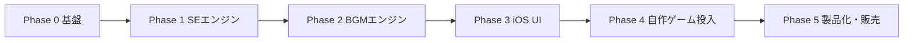

# GameSoundCreator ロードマップ

| 項目 | 内容 |
|------|------|
| 文書バージョン | 0.2 |
| 最終更新 | 2026-07-26 |
| 前提仕様 | [SPEC.md](SPEC.md)（v0.2） |

本ロードマップは **一人開発・まず自用・最終的に iOS 販売** を前提にした現実的な計画です。期間は目安であり、音の品質調整で前後します。

---

## 全体像

| Phase | テーマ | 目安期間 | 主な成果 |
|-------|--------|----------|----------|
| 0 | プロジェクト基盤 | 数日 | Xcode / SPM / 再生・書き出しの骨格 |
| 1 | 効果音エンジン | 2–4 週 | SE 8種以上、シード再現、WAV書き出し |
| 2 | BGMエンジン | 3–6 週 | ループBGM 2プリセット |
| 3 | アプリUI | 2–4 週 | 試聴・パラメータ・ライブラリ |
| 4 | カードバトル連携 | 1–3 週 | 実ゲームに音を載せる |
| 5 | 販売準備 | 3–6 週 | StoreKit、規約、審査提出 |

**合計の現実的レンジ:** 初の TestFlight までおおよそ **3〜5 ヶ月**（週あたりの稼働による）。  
**App Store 公開**は品質と法務のバッファを見て **その後 1〜2 ヶ月**。

---

## Phase 0 — 基盤（数日）

### 目的

「音を出してファイルに残せる」最小パイプを先に作る。UI の見た目より先にオーディオ経路を確定する。

### タスク

- [x] Xcode で iOS アプリ作成（SwiftUI、iOS 17+）
- [x] Swift Package `AudioGenCore`（仮称）をリポジトリ内に追加
- [x] `AVAudioEngine` でバッファ再生
- [x] `AVAudioFile` で WAV 書き出し
- [x] サイン波1秒を生成 → 再生 → Documents に保存、までを自動化できること
- [x] 実機で音声確認（シミュレータのみに依存しない）

### 完了条件

- 実機で「生成 → 再生 → 書き出し → Files で確認」が一通り通る（コード側は準備済み）

### この段階でやらないこと

- 凝った UI、課金、複数スタイル、広告

---

## Phase 1 — 効果音エンジン（2–4 週）

### 目的

自作カードバトルにすぐ使える SE を手続き生成する。ここが最初の実用価値。

### タスク

- [x] Recipe モデル（JSON）の定義と Codable 実装
- [x] 共通オシレータ / ノイズ / ADSR エンベロープ
- [x] カテゴリ別ジェネレータ（SPEC の SE 表から最低 8 種）※12種実装
- [x] `seed` 固定での再現性テスト
- [x] 簡易マスタリング（ゲイン正規化、軽いリミッター）
- [x] デバッグ用: カテゴリと seed をコードまたは一時UIから指定して試聴

### 完了条件

- [x] 8 カテゴリ以上で、パラメータ変更が聴感に反映される
- [x] 同一 Recipe で波形が実質同一（テストで検証）
- [x] WAV 書き出しがカテゴリ名＋seed 付きファイル名で可能

### 成果物の使い方

書き出した SE をカードバトル試作に仮置きし、「足りない音」「弱い音」のリストを次 Phase にフィードバックする。

---

## Phase 2 — BGM エンジン（3–6 週）

### 目的

ループ可能な戦闘 / メニュー BGM を出せるようにする。

### タスク

- [x] テンポ・調性・小節数を持つシーケンサ骨格
- [x] コード進行テンプレート（少数でよい）
- [x] ドラム / ベース / コードのレイヤー
- [x] オプションのメロディレイヤー
- [x] ループ境界のクロスフェード書き出し
- [x] プリセット `bgm.battle.normal` / `bgm.menu.main`
- [x] 生成時間の計測と、長すぎる場合の簡略化（同時発音数など）

### 完了条件

- [x] ループ再生して継ぎ目が明らかなノイズにならない（クロスフェード実装・要実機耳確認）
- [x] 2 プリセット以上を seed 違いでバリエーション生成できる
- [x] 32 秒前後を許容時間内に生成できる（テストで数秒以内）

### 品質の目安

「良い作曲」より「ループとしてゲームに置ける」。耳障りな不協和・破綻をルールで防ぐことを優先する。

---

## Phase 3 — iOS アプリ UI（2–4 週）

### 目的

自分以外でも操作できる **意図選択ウィザード** にする。販売を見据えた情報設計の土台。  
（詳細は SPEC v0.2 の UI 章。技術パラメータ全面のスタジオUIは採用しない。）

### タスク

- [x] ホーム（BGM / 効果音の2択＋最近の音）
- [x] 意図ウィザード: ジャンル → シーンまたは用途 → 雰囲気・長さ → 生成
- [x] 結果画面: 再生、別パターン、保存、書き出し、微調整、条件のやり直し
- [x] Intent ↔ Catalog ↔ Mapper を UI から呼び出す配線
- [x] 未対応カタログを出さない（選べる＝鳴る）
- [x] Intent / Recipe のお気に入り保存（JSON または SwiftData）
- [x] 共有シートでのファイルエクスポート
- [x] 基本的なエラー・空状態表示
- [x] 再生バー（現在位置／長さ）

### 完了条件

- [x] 初見でもウィザード数ステップで音が鳴る
- [x] 保存した Intent（＋seed）から再生成できる
- [x] MVP カタログ（カードバトルの主要シーン／SE用途）に UI から到達できる
- [ ] 実機でのウィザード一連操作確認（ユーザー確認待ち）

### UI メモ

販売時のブランドは後で磨いてよい。この Phase は **ゲームの言葉での導線** を優先する。

---

## Phase 4 — 自作カードバトルへの投入（1–3 週）

### 目的

「作った音がゲーム体験を支える」ことを証明する。販売前の最良のデモにもなる。

### タスク

- [ ] ゲーム側イベント一覧とファイル命名規則の確定
- [ ] `mapping.json`（任意）のエクスポートとゲーム側読み込み
- [ ] 戦闘・メニュー・主要SEの実装
- [ ] 音量バランス調整（SE が BGM を潰さない）
- [ ] 「足りない音」を本アプリのバックログへ還元

### 完了条件

- カードバトルの主要フローが無音ではない
- 本アプリなしでもゲームがアセット再生できる（書き出し済みファイル運用）

---

## Phase 5 — 製品化・App Store 販売（3–6 週）

### 目的

一般ユーザーが安心して使える状態にし、買い切りまたは広告付きで公開する。

### タスク

- [ ] 利用規約・プライバシーポリシー（生成物の利用権を明記）
- [ ] StoreKit 2 による Pro 買い切り（または広告除去）
- [ ] Free 制限の実装（書き出し回数など）※モデル確定後
- [ ] 必要なら広告SDK（ATT 方針含む）
- [ ] アプリアイコン、スクリーンショット、説明文（「手続き生成」「オフライン」を明記）
- [ ] TestFlight 外部テスト（少人数でよい）
- [ ] App Review 提出・指摘対応

### 完了条件

- TestFlight で重大バグなし
- 審査提出可能な法務・メタデータが揃っている
- 課金または広告の経路が実機で動作確認済み

### 収益モデルの推奨順序

1. まず **無料（自分用 TestFlight）** で品質を固める  
2. 公開時は **無料＋書き出し制限＋買い切り Pro** が扱いやすい  
3. 広告は「書き出し追加」などの任意導線に留め、ツールとしての信頼を優先  

---

## Phase 6 以降（バックログ）

優先度は販売後のフィードバックで決める。

| 項目 | 内容 |
|------|------|
| スタイル追加 | チップチューン、ダークファンタジー、SF など |
| バッチ書き出し | カードバトル一式をワンタップ |
| インタラクティブBGM定義 | 緊張度レイヤーの Recipe 拡張 |
| macOS 版 | 大画面での量産向き |
| コアの C++/Rust 化 | 性能・移植が必要になったときだけ |
| Android | iOS の収益と需要を見て判断 |

---

## マイルストーン一覧

| ID | マイルストーン | 判定 |
|----|----------------|------|
| M0 | サイン波の書き出し成功 | Phase 0 完了 |
| M1 | SE 8 種が自作ゲームに仮置き可能 | Phase 1 完了 |
| M2 | ループ BGM が戦闘画面で鳴る | Phase 2＋一部 Phase 4 |
| M3 | UI から完結して書き出し可能 | Phase 3 完了 |
| M4 | カードバトル主要フローに音が載る | Phase 4 完了 |
| M5 | TestFlight | Phase 5 途中 |
| M6 | App Store 公開 | Phase 5 完了 |

---

## 週次の進め方（推奨リズム）

一人開発向けの軽い運用:

1. **週の目標をマイルストーン単位で1つ**に絞る（例: 「攻撃SE3種の聴感を上げる」）
2. **毎週末に実機でカードバトルに1音でも入れる**（机上の音だけにしない）
3. **Recipe とテストを先に増やす**（UI よりエンジンの回帰を守る）
4. 音質に行き詰まったら、新機能より **プリセットとマスタリングの調整** に時間を使う

---

## 意思決定ログ（初期）

| 日付 | 決定 | 理由 |
|------|------|------|
| 2026-07-26 | メイン言語は Swift | iOS 販売・ローカル音声・再実装回避 |
| 2026-07-26 | 外部AIは使わない | オフライン・コスト・ストア説明の簡潔さ |
| 2026-07-26 | 書き出し優先、ランタイム合成は後回し | 自作ゲーム連携が早い |
| 2026-07-26 | SE → BGM → UI → 販売の順 | 早期に自用価値を出す |
| 2026-07-26 | UIは意図ウィザード（ジャンル・シーン・用途・雰囲気・長さ） | 音楽知識なしで使える販売体験に合わせる |
| 2026-07-26 | Intent → Mapper → Recipe の層を設ける | カタログ拡充とエンジン再現性を両立 |

新しい大きな方針変更があれば、この表に追記する。

---

## 次のアクション（実装開始時）

仕様に合意できたら、Agent モードで次を実施する:

1. Xcode プロジェクトと `AudioGenCore` パッケージのスキャフォールド  
2. Phase 0 のサイン波パイプライン実装  
3. Phase 1 の最初のカテゴリ（例: `sfx.ui.tap`, `sfx.attack.light`）から着手  

本ドキュメントは実装の進捗に合わせてチェックボックスを更新していく。
